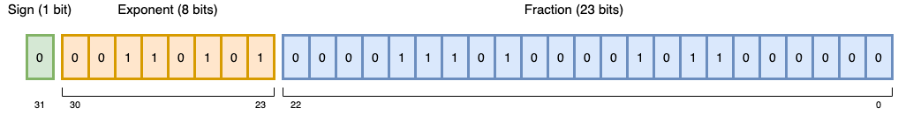

## Being Real in a Discrete World

$$\mathbb{R}$$

In computation that deals with real-world quantities, we need approximation. This is not unique to 
digital computation; with a humble pen and paper, we will never be able to write the quantity $\frac{1}{3}$
as a decimal number, just a decent approximation (0.3333333333333....). The core issue is that of represesentation. 
How we choose to represent a number impacts the quality of the approximation, but we will always be 
bound by the finite world. 

Later on, we'll 
take a look at the [core tradeoffs](#range-versus-precision) to consider.

In digital computation, the core representation format we use is a given - binary numbers! Since working 
with the real numbers is so critical for most applications, how we represent them in binary 
is an incredibly important topic. Here, we'll focus on the [IEEE-754](https://en.wikipedia.org/wiki/IEEE_754) 
specification of 32-bit and 64-bit floating-point 
numbers[^1]. Since it's a mouthful, let's use the official alternate names for these from now on: **binary32** and 
**binary64**, respectively.

But first, some context.

## The Integers

$$\mathbb{Z}$$

The problem of representing integers in binary is fairly straightforward - we are just constrained by the number 
of bits we want to use. And really, this isn't any different than our regular base-10 number system right? Given 
3 digits, the largest postive base-10 number we can write is 999, and with binary it is 111.


If we want to include negative numbers, we also need to devise a way to represent the sign of a number too. Here's 
an example of one way to do this in binary when allowed 4 bits:

(sign)(digits)

A few examples of conversion from that to our regular base-10 notation are below.

- $$1001 \rightarrow -1$$
- $$0111 \rightarrow 7$$
- $$1000 \rightarrow -0$$
- $$0000 \rightarrow +0$$

Notice that in this naive implementation, we can represent 0 in two ways! There are ways around this, but it's 
good to remember from here on that we are in digital wonderland.

**Note**: *The standard for how signed and unsigned integers are stored is slightly different, this is just an example. Read more [here](https://en.wikipedia.org/wiki/Integer_(computer_science)).*

## The Reals ($$\mathbb{R}$$)

We have much worse problems when we get to the real numbers, or $\mathbb{R}$. Yes, we will always be constrained to finite methods of 
representation, but now we need to worry about the gaps *between* numbers, and we don't even need to think about 
binary to see this clearly.

Let's look at the size of the gap between the number 3 and 5 in these two different worlds:

- In the integers: $$|\{a \in \mathbb{Z}: 3 < a < 5\}| = 1$$
- In the reals: $$|\{a \in \mathbb{R}: 3 < a < 5\}| = \aleph_{1}$$ (uncountably infinite)[^2]

So even when limiting ourselves to small finite numbers, we can still never hope to represent all numbers (not 
even those between 3 and 5). Time to approximate!

## Binary32 Numbers

Let's dive in and see how this is actually done. 

Quick notation comment:
- Binary numbers will be written like $$(1011)_{2}$$ to distinguish them from base-10 numbers
- Their individual bits will be specified by $$b_i$$ where $$i$$ is the index of the digit counting from right to left starting at 0
    - For $$(1011)_{2}$$, $$b_2$$ is 0
    - Check out the diagram below for a visual

### Anatomy

There are 3 different segments of each:

1. **Sign** (1 bit)
    - This is either a 0 (positive) or 1 (negative). Easy enough!
2. **Exponent** (8 bits)
    - b
3. **Fraction** (23 bits)[^3]
    - c



### Convert to Decimal Number

As a brief review, remember how regular scientific notation works. 
Take the decimal 131.2 for example. In scientific notation we could write it as $$1.312 \times 10^{2}$$. 
The point of this is to separate the important digits of a number from its magintude. This provides 
an **equally compact representation** for both large and small numbers.

$$
\begin{aligned}
1,312,000,000,000 &= 1.312 \times 10^{12} \\
0.000000000001312 &= 1.312 \times 10^{-12}
\end{aligned}
$$

Now what about base-2 scientific notation? It's actually exactly the same! The binary number $$(1011)_{2}$$ 
can be written as $$(1.011)_{2} \times 2^{3}$$. We can now easily come up with the formula for converting 
binary32 to base-10.

$$
(-1)^{b_{31}} \times 2^{(b_{30}b_{29} \dots b_{23})_2 - 127} \times (1.b_{22}b_{21} \dots b_{0})_2
$$

Let's break this down.

#### Sign

This one is simple - negative/positive is already a binary value!

#### Exponent

We want to be able to represent both very large and very small numbers, which means we need positive and 
negative exponents, and so the decimal value of the 8 bits will be centered. Because the 
exponent values $$(00000000)_{2}=0$$ and $$(11111111)_{2}=255$$ are reserved, there are $$2^8 - 2 = 254$$
total possible values. After subtracting 127, the range of this 8 bit number is then $$(-126,127)$$ 
instead of $$(1,254)$$.

#### Fraction

This is pretty straightforward but has a big caveat. The standard specifies that only *normalized* binary 
numbers can be represented in the fraction, which means **no leading 0's are allowed**. That means the 
most significant bit always has to be a 1. This as an advantage though - we don't need to store the 
most significant bit if it's always 1, so we basically get a whole bit of information for free! When 
written out, the actual binary number that the 23 fraction bits represent is $$(1.b_{22}b_{21} \dots b_{0})_2$$.
For example, the 23-bit fraction 0000110011001100110011 would be interepreted as 
$$(1.0000110011001100110011)_{2}$$.

With this in mind, the conversion formula resembles any other decimal conversion:

$$
(1.b_{22}b_{21} \dots b_{0})_2 = 1 + \sum^{23}_{i=1} b_{23-i} 2^{-i}
$$

An immediate consequence of this is that the decimal value represented by the fraction of a binary32 number 
is always in the half-open interval $$[1, 2)$$.

### Subnormal Numbers

Did you notice that there is now way to write 0 with these rules? We can get very close, but there's no 
way to write exactly 0. In fact, there's no way to write a large class of numbers that are close to 0. 
The specification defines **subnormal numbers** as all numbers in the interval $$[0, 1)$$

### Verify with Python

First things first, here's my environment.

```python:title=Version&nbsp;Check
import sys
import numpy as np
print("Python Version {}".format(sys.version.split(" ")[0]))
print("Numpy Version {}".format(np.__version__))
```

```:title=Output noLineNumbers
Python Version 3.9.1
Numpy Version 1.21.2
```

Okay, let's look at the binary representation of a binary32 number. There are several ways to accomplish this, 
but I'm using numpy because of the range of numeric data types available.

```python
# intialize a 32-bit float
x = np.float32(131.2)
# convert to a binary string represntation w/ leading 0's
x_bin = "{:032b}".format(x.view(np.uint32))

print(x_bin)
print("{:6}{:11}{:23}\n{:6}{:11}{:23}".format("Sign", "Exponent", "Fraction", x_bin[0:1], x_bin[1:10], x_bin[10:]))
```

```:title=Output noLineNumbers
01000011000000110011001100110011
Sign  Exponent   Fraction               
0     100001100  0000110011001100110011 
```

convert this back to decimal
point out that not all numbers can be expressable


## Range vs. Precision


## 64-Bit Numbers

explain 64 bit and math

verify with python

---

## Comparison of binary32 and binary64

---

## FLOPS Measurement

---

## Caveats

There are some edge cases that are handled by definition, subnormal, 0, etc.

[^1]: The Institute of Electrical and Electronics Engineers (IEEE) maintains this standard, which is by far the most common in modern computer architectures. You'll also see these called *single-precision* and *double-precision* numbers.
[^2]: Reference or resource for continuum stuff
[^3]: The fraction is also called a mantissa in a lot of resources.
